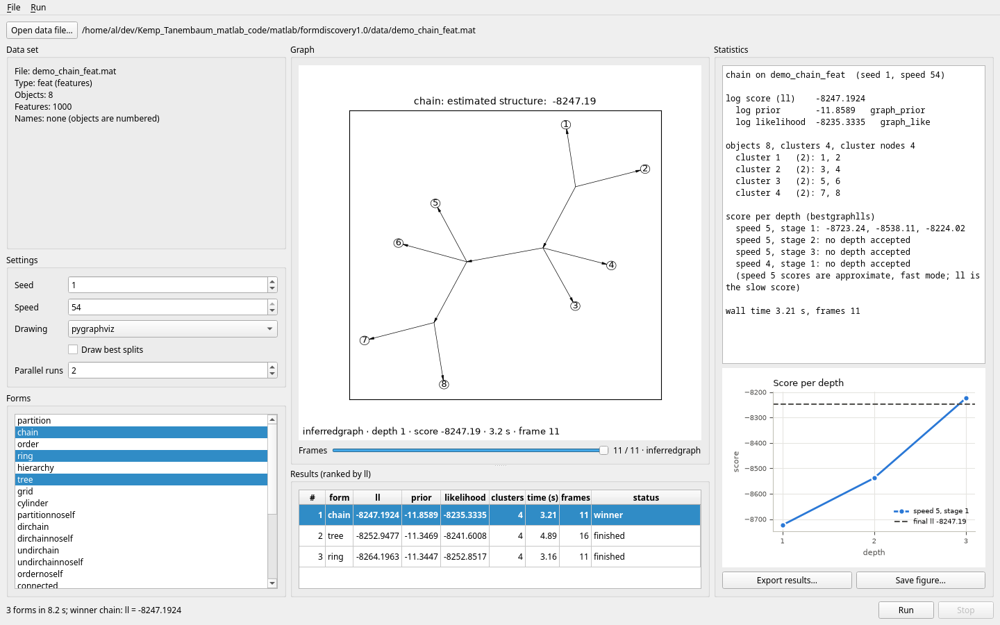

# Kemp-Tenenbaum form discovery: MATLAB to Python

A test-driven translation of Charles Kemp's `formdiscovery1.0` MATLAB code, which implements
the structural form discovery model from:

> Kemp, C., & Tenenbaum, J. B. (2008). The discovery of structural form. *PNAS*, 105(31), 10687–10692.

The model fits graph structures (partitions, chains, orders, rings, hierarchies, trees, grids,
cylinders) to feature, similarity, or relational data and returns the best structure of each
form together with its posterior probability.

## Status

The model is fully translated and verified against the original code running in GNU Octave.
The Python port runs the original `masterrun` demo end to end:

- With Octave's random permutations replayed, all nine demo runs (chain, ring, tree × three
  feature data sets) reproduce the Octave baseline: final scores to ten significant digits,
  and identical final graphs and growth histories.
- Without replay (numpy permutations, scipy optimiser, three seeds), every run finds the
  same clustering as Octave (adjusted Rand index 1, same cluster count) with scores within
  about 1e-5 relative.
- Deterministic code (utilities, priors, graph construction, likelihoods, relational model)
  matches Octave to near machine precision. The one irreducible gap is the branch-length
  optimiser: Octave's `fminunc` stops early, so log-evidence values agree to about 2e-4
  relative, and Python's optimum is never worse than Octave's.

Anomalies found along the way (for example, on the `animals` data the code prefers a hierarchy
where the paper reports a tree) are logged in `ANOMALIES.md`.

- Paper-level checks: every synthetic data set recovers its true form and `colors` gives a
  ring, in Octave and in Python.
- The display code (`draw_dot`, `graph_to_dot`, `dot_to_graph`, `graph_draw`) is ported
  with pygraphviz and matplotlib, and gives the same DOT text and node positions as the
  original. networkx, plotly and pyvis backends and GraphML/DOT exports are also
  available.

- Speed: per call, fast-mode scoring takes about half of Octave's time and relational
  scoring a fifth. Slow mode, with scipy's trust-exact optimiser, takes 1.4-3.6 times
  Octave's `fminunc`. Whole runs take 0.8-1.4 times Octave's, 0.25 on relational data.
  The model keeps BLAS to one thread, because OpenBLAS threads made it up to 20 times
  slower on these small matrices; the results do not change. Run
  `python tools/bench_perf.py` to measure it on your machine.

Progress is tracked in `RalphLoops/loop0001/PROGRESS.md` and `iterations.md`.

## Quick start

```bash
conda env create -f environment.yml      # env "fd": Python, numpy/scipy, Octave, oct2py, pygraphviz
conda activate fd
pip install -e .

formdiscovery run                                            # masterrun demo: chain,ring,tree × datasets 1-3
formdiscovery run --structures dirringnoself --datasets 4 --seed 3 --out results/
formdiscovery run --help
```

From Python:

```python
from formdiscovery.run import masterrun
res = masterrun()            # MasterResults: names, ll, cluster counts, z, graphs, ps per run
```

Data sets and structure names follow the original `setps.m` (20 data sets, 24 forms); both
can be given by name or 1-based index.

## Usage

The notebook [`examples/formdiscovery_demo.ipynb`](examples/formdiscovery_demo.ipynb) runs
the whole `masterrun` demo, compares it with Octave and draws the results with every
backend. `python tools/gen_demo_notebook.py` rebuilds and runs it.

### Running the model

```python
from formdiscovery.run import masterrun, masterrun_ps, runmodel, save_results

ps = masterrun_ps()                       # defaultps(setps()) with reloutsideinit = 'overd'
res = masterrun(ps, thisstruct=[1, 3, 5], thisdata=[0, 1, 2], seed=1, log=print)
res.modellike[:, :, 0]                    # log posterior per (structure, data set)
graph = res.structure[5, 2, 0]            # the tree fitted to demo_tree_feat
names = res.names[0, 2]
save_results(res, "results/resultsdemo", ps)   # .npz + .json, read back with load_results

ll, graph, names, bestglls, bestgraph = runmodel(ps, 5, 2, 1, rng=1)   # a single run
```

In Python, the structure and data set indices are 0-based (`ps.structures[5] == 'tree'`,
`ps.data[2] == 'demo_tree_feat'`). The CLI takes names or MATLAB's 1-based indices.
`rng` is a seed or a permutation provider (`formdiscovery.rng`).
`runmodel` and `structurefit` limit BLAS to one thread while they run
(`formdiscovery.threads`, needs `threadpoolctl`). Wrap your own loops over `graph_like` in
`with formdiscovery.threads.blas_threads():` for the same speed-up. On the command line
the option is `formdiscovery run --blas-threads N` (0 keeps the library's setting).

### Drawing graphs

`draw_dot(adj, labels, backend=...)` is `draw_dot.m`. It returns MATLAB's
`(xret, yret, labels)`, and `return_figure=True` also returns the figure.

| Backend | Needs | Layout | Output |
|---|---|---|---|
| `pygraphviz` (default) | pygraphviz or the `neato` executable | neato with draw_dot's flags (positions equal the original's) | matplotlib, the `graph_draw.m` ellipses and arrows |
| `networkx` | nothing extra | neato via pygraphviz, else Kamada-Kawai (`layout=`) | matplotlib, `nx.draw_networkx` |
| `plotly` | `pip install -e .[interactive]` | as `networkx` | interactive `plotly` figure with hover text |
| `pyvis` | `pip install -e .[interactive]` | as `networkx` | vis-network HTML page |

```python
from formdiscovery.viz.draw import draw_dot, draw_graph, draw_results, ProgressFigures
from formdiscovery.viz.networkx_backend import to_networkx, to_graphml, to_dot

draw_results(res, path="results.png", backend="networkx", layout="kamada_kawai")
draw_results(res, path="results.html", backend="plotly")    # all runs, interactive

fig = draw_graph(graph, names, backend="plotly")            # hover: object -> cluster,
fig.show()                                                  #        cluster -> members
draw_graph(graph, names, backend="pyvis").write_html("tree.html")

G = to_networkx(graph, names)          # DiGraph; node kind/label/cluster_id, edge W and 1/W
to_graphml(graph, "tree.graphml", names)                    # for Gephi / Cytoscape

# MATLAB's progress figures 1-3 (pre-clean, post-clean, best split / result)
show = ProgressFigures(outdir="figures", backend="networkx")
runmodel(ProgressFigures.enable(ps), 5, 2, 1, show=show)
```

From the shell:

```bash
formdiscovery run --structures chain,ring,tree --datasets 1,2,3 --out results/ --figures figs/
formdiscovery draw results/resultsdemo.npz --out results.png                 # neato + matplotlib
formdiscovery draw results/resultsdemo.npz --out results.png --backend networkx --layout kamada_kawai
formdiscovery draw results/resultsdemo.npz --out results.html --backend plotly
formdiscovery draw results/resultsdemo.npz --out tree.html --backend pyvis --runs 8
formdiscovery draw results/resultsdemo.npz --out tree.svg --graphviz --runs 8  # Graphviz renders (pygraphviz)
```

Display quirks of the original are kept by default. Each undirected edge is drawn as two
arrows (KI-37); use `undirected='lines'` for plain lines. draw_dot's neato flags are
malformed (KI-32/35); use `flags='intended'` for the documented ones. See
`KNOWN_ISSUES.md`.

### GUI

A PySide6 desktop app (`pip install -e .[gui]`; in the fd env it is already installed):

```bash
formdiscovery gui                                                  # pick a file with "Open data file…"
formdiscovery gui matlab/formdiscovery1.0/data/demo_chain_feat.mat # start with a data set loaded
formdiscovery gui --demo                                           # open demo_chain_feat and run chain
```

Open any `.mat` data file (the shipped ones or your own: `data` as features, a similarity
matrix or a relational struct, optional `names`). The left column describes the data set
and has the forms (chain, ring, tree preselected), seed, speed, drawing backend and "Draw
best splits". Run fits every selected form, each in its own worker thread ("Parallel runs"
at a time; one by default), so the window stays responsive and Stop works at any time. The middle canvas redraws the graph each time the
model transforms it (pre-clean / post-clean per depth, best splits if chosen, then the
inferred graph), with node positions kept between frames. When the run ends, the
Statistics column shows the final score and its parts (log prior from `graph_prior`, log
likelihood from `graph_like`), the clusters and their members, the score per depth
(`bestglls`) as a chart, wall time and frame count. "Export results…" writes the `.npz` +
`.json` pair that `formdiscovery run` writes (read back with `load_results`), and "Save
figure…" saves the graph as PNG or SVG.

The "Results" table under the graph ranks the forms by ll (the winner in bold, as
masterrun's `modellike` would pick it); click a row to see that form's final graph and
statistics. The slider under the graph scrubs back through the frames the shown form sent
(the last 500 per form are kept); at its right end the canvas is live again. Parallel runs
share one Python process, so they overlap little (the search holds the GIL; ANOMALIES A27).

Keyboard shortcuts (also in the File and Run menus): Ctrl+O open, Ctrl+R or F5 run,
Esc or Ctrl+. stop, Ctrl+E export results, Ctrl+Shift+S save figure, Ctrl+Q quit. A file
that cannot be read, a failed run or a failed export opens a warning box (a failed run's
traceback is under "Show Details…"). The file dialog starts in the last directory a file
was loaded from (`~/.config/formdiscovery/gui.ini`). The window title names the file. The
GUI needs no Octave (only the tests compare against it).



The GUI is a thin shell over the port (`src/formdiscovery/gui/`); its only hook into the
model is `search.run_hooks` (per-thread cancel and per-depth callbacks, off by default, so
results are unchanged). Screenshots, with a description of each: [`examples/gui/`](examples/gui/README.md)
(`QT_QPA_PLATFORM=offscreen python tools/gui_screenshots.py`).

## How it was verified

- Every MATLAB function has an Octave fixture script in `tests/octave/` that runs the original
  code on real inputs and saves inputs and outputs to `tests/fixtures/*.mat`. The pytest
  suite compares the Python translation against those fixtures, so the tests run without
  Octave. Tests marked `octave` additionally drive Octave live through oct2py. They are
  skipped when it is not installed, except in strict mode (the `fd` env's Python, or
  `RALPH_REQUIRE_OCTAVE=1`), where a skipped Octave test fails the run;
  `tests/test_gate_env.py` checks the toolchain itself.
- Structural outputs are compared exactly; deterministic floats at `rtol=1e-10`;
  optimiser-dependent values by optimality (objective and gradient norm no worse than
  Octave's) plus a documented tolerance.
- Randomness enters only through `randperm`. An Octave shim (`matlab/octave_shims/`) records
  or replays permutations, and `formdiscovery.rng` provides matching Python providers, so the
  search heuristics are compared with identical random choices.
- The Octave baseline runs (`matlab/run_baseline.m`) for the feature and relational demo grids
  are committed under `tests/fixtures/baseline/`.
- Every process runs one BLAS/OpenMP thread (`OPENBLAS_NUM_THREADS`, `OMP_NUM_THREADS`,
  `MKL_NUM_THREADS` = 1, `formdiscovery.threads.PIN_ENV`). The test session, the Oct2Py
  Octave and every `octave-cli` the tools start are pinned; speed comes from running
  processes side by side. Pinned and unpinned runs give identical `.mat` contents
  (`tools/mat_compare.py DIR_A DIR_B` compares two output directories), except for
  `gibbs.mat`. Its `grid x synthgrid` run depends on the BLAS thread count, so it is
  regenerated unpinned (ANOMALIES A19, `BLAS_DEFAULT_FIXTURES` in `tests/conftest.py`).
- Fixtures regenerate in parallel: `tools/gen_fixtures.py --jobs N` (default cores/2) runs
  one `octave-cli` per fixture script (paperlevel split into its 45 runs), so a script that
  reads another fixture waits for it. It keeps a log per task and prints a timing table. All 31 fixtures take
  7 min 56 s with `--jobs 16` against 68 min 49 s with `--jobs 1`. The two runs and the
  committed fixtures have the same content (`--compare DIR`: loaded arrays to all digits,
  timing fields skipped, temp-directory names masked).
- The baselines regenerate in parallel too: `tools/gen_baselines.py --kind feat|rel --jobs N`
  runs one `octave-cli` per (structure, dataset) pair, each into its own directory. A merge
  (`matlab/baseline_merge.m`, plus a copy of the `results/` trees) then writes what the
  serial `run_baseline` writes. The merged output has the same file set and content as the
  committed `tests/fixtures/baseline/{feat,rel}` (`--compare DIR`; only `timings.seconds`
  is skipped). With `--jobs 16` feat takes 5.8 s and rel 14.6 s, against 33–46 s and
  140–176 s for serial `run_baseline`.
- The gate runs in parallel with pytest-xdist (`-n 16`). Each worker has its own Octave
  process (its own session-scoped `octave` fixture), and tests write only to `tmp_path`.
  A run that leaves a new file under `tests/` fails. Under xdist the tests that take 30 s
  or more (`LONG_TESTS` in `tests/conftest.py`) start first, one per worker
  (`--maxschedchunk 1`). The gate then takes about 6 min (the longest test, gibbs
  `test_live_fresh_seeds`, alone takes about 6 min) against about 40 min serial. Three
  runs at `-n 16` and one at `-n 8` gave the same pass set.
- `tools/compare_live.py --pairs S:D[:SEED] ... --jobs N` runs Octave and Python side by
  side. For each (structure, dataset, seed) a worker runs `run_baseline` in its own
  `octave-cli` with the `randperm` shim logging every draw. It then runs Python's
  `runmodel` on the same pair, replaying those draws without oracles: Python uses its own
  optimizer and tie breaking, and once a draw no longer fits it goes on with numpy. The
  output is one table: Octave and Python ll, relative difference, ARI, cluster counts, how
  far the replay went, and each side's wall time. The default set (the 9 feature and 54
  relational baseline pairs, seed 1) passes PLAN §7.1 on all 63 rows. Octave reproduces the
  committed baseline exactly. The relational scores agree to 1e-15, and the feature scores
  to 7.4e-6 relative, with ARI 1 everywhere. This takes 26 s with `--jobs 16` against 3 min
  35 s with `--jobs 1`, and the rows are identical apart from the times.

Before and after the parallel harness (`RalphLoops/loop0002`, 32-core machine; every
parallel run gives the same contents as the serial one):

| task | before | after | CPU (user+sys) before → after | workers after |
|---|---|---|---|---|
| all 31 fixtures (`gen_fixtures.py`) | 68 min 49 s (`--jobs 1`; paperlevel alone ≈ 81 min in one process before) | **7 min 56 s** (`--jobs 16`) | 4530 s → 5310 s | 16 `octave-cli` |
| both baseline grids (`gen_baselines.py`) | 2 min 45 s (serial `run_baseline` feat + rel) | **20 s** (feat 5.8 s + rel 14.6 s, `--jobs 16`) | 176 s → 193 s (`--jobs 1` → 16) | 9 / 16 `octave-cli` |
| gate, Octave live (strict) | 38 min 18 s (serial, unpinned BLAS) | **≈ 6 min** (`-n 16`, 6:01–6:12 over three runs) | 4482 s → ≈ 3570 s | 16 pytest workers + 16 Octave |
| Octave vs Python, 63 pairs (`compare_live.py`) | 3 min 35 s (`--jobs 1`) | **26 s** (`--jobs 16`) | 217 s → 257 s | 16 workers + their `octave-cli` |
| slow suite (`-m slow -n 16`, 80 tests) | 37 min 41 s, 1 timing failure (each worker reran the 45 paperlevel Python runs on all cores) | **9 min 02 s** (run once, shared through a file: `tests/helpers.xdist_shared`) | 62 794 s → 6 100 s | 16 pytest workers + 16 Octave |

Before this work the gate ran under a Python without oct2py, so the live Octave tests were
skipped; it now runs them all and fails if one is skipped.

```bash
~/anaconda3/envs/fd/bin/python -m pytest -q -m "not slow" -n 16   # regression gate, Octave live (strict), ~6 min
~/anaconda3/envs/fd/bin/python -m pytest -q -m "not slow"   # the same gate serially (~40 min)
python -m pytest -q -m "not slow"     # fixture-only run under another Python (~1 min)
python -m pytest -q -m octave         # live Octave parity (needs the fd env)
~/anaconda3/envs/fd/bin/python -m pytest -q -m slow -n 16   # long runs (~9 min)
python tools/gen_fixtures.py          # regenerate all fixtures through Octave (cores/2 at once)
python tools/gen_fixtures.py --outdir D --compare tests/fixtures   # regenerate elsewhere, compare
python tools/gen_baselines.py --kind rel --outdir D --compare tests/fixtures/baseline/rel
python tools/mat_compare.py A B       # compare two directories of .mat outputs by content
python tools/compare_live.py --jobs 16   # Octave vs Python on the 63 baseline pairs (~30 s)
```

## Layout

| Path | Contents |
|---|---|
| `src/formdiscovery/` | The port. `graph.py` (graph structure and grammars), `likelihood_feat.py` / `likelihood_rel.py` (scores), `search.py` (split, swap, prune-and-regraft, `gibbs_clean`, `structurefit`), `run.py` (`runmodel`, `masterrun`), `cli.py`, `rng.py`, `params.py`, `preprocess.py`, `weights.py`, `matlab_compat.py`, `io.py` |
| `src/formdiscovery/viz/` | Display: `dot.py` (DOT text), `pygraphviz_backend.py` + `graph_draw.py` (draw_dot's layout and drawing), `draw.py` (the `draw_dot` facade, progress figures, results), `networkx_backend.py` (conversion, exports), `plotly_backend.py`, `pyvis_backend.py`, `interactive.py` |
| `examples/` | `formdiscovery_demo.ipynb`: the masterrun demo end to end, with figures |
| `src/formdiscovery/CONVENTIONS.md` | Index, ordering and dtype rules used throughout the port |
| `matlab/formdiscovery1.0/` | Verbatim copy of the original MATLAB sources and data, plus 16 documented Octave-compatibility edits (`matlab/PATCHES.md`) |
| `matlab/run_baseline.m` | Headless Octave reproduction of `masterrun` used to produce the baseline fixtures (`baseline_merge.m` merges per-pair runs for `tools/gen_baselines.py`) |
| `ANOMALIES.md` | Curated log of anomalies found: paper vs code, Octave vs MATLAB, surprising results, original bugs, each with a status |
| `KNOWN_ISSUES.md` | Bugs and quirks of the original and how the port treats each one (replicate, fix, or not ported) |
| `tests/` | Fixture scripts (`tests/octave/`), fixtures, pytest parity tests, Octave baselines |
| `tools/` | Fixture generation, Octave/Python run comparison, benchmark (`bench_perf.py`) |
| `PLAN.md` | The translation plan: test architecture, dependency-ordered steps, hazards, milestones |
| `RalphLoops/` | The fresh-context iteration loop that carried out the plan |

## Conventions

Python function names match the MATLAB file names (`graph_like_conn`, `gibbs_clean`, ...),
and each docstring cites the source lines it translates. Indices are 0-based in Python and
converted only at the I/O boundary. Quirks of the original are replicated by default; the
only deliberate deviations are that `keyboard` debug stops become exceptions and `runmodel`
writes to an explicit output directory instead of changing the working directory.

## Credits

Original MATLAB code: Charles Kemp (2008), with contributions from Kevin Murphy (BNT),
Thomas Minka (lightspeed), Leon Peshkin (Graphviz interface), Carl Rasmussen, John Burkardt,
and Michael Kay, as listed in the original `README.txt`.

Translation by Alex Linhares using Claude Code. 
