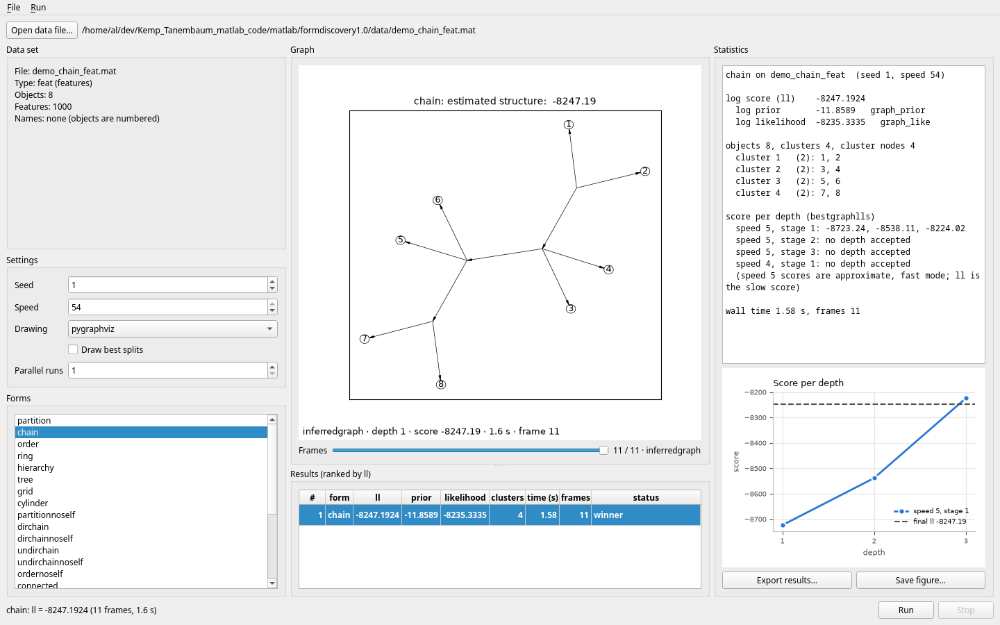
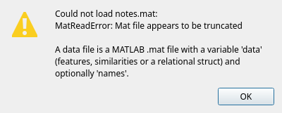

# GUI screenshots

Offscreen `grab()`s of the PySide6 app (`formdiscovery gui`, loop0003), all on the shipped
`demo_chain_feat` (8 objects, 1000 features), seed 1, speed 54. Regenerate them with

```bash
QT_QPA_PLATFORM=offscreen python tools/gui_screenshots.py [--outdir examples/gui]
```

| File | What it shows |
| --- | --- |
| [`01_picker.png`](01_picker.png) | The window with the data set loaded: data set description, settings, the 24 forms with chain/ring/tree preselected (item 01). |
| [`02_run.png`](02_run.png) | After Run fitted chain in a worker thread: the status line has the score, frame count and time (item 02). |
| [`03_live_mid.png`](03_live_mid.png) | The live canvas during a chain run with best splits drawn, at the first frame it drew (earlier frames came faster and were coalesced) (item 03). |
| [`03_live_end.png`](03_live_end.png) | The same run's inferred graph; the nodes stay where they were mid-run (item 03). |
| [`04_stats.png`](04_stats.png) | The Statistics column: ll = prior + likelihood, clusters and members, score per depth chart, export buttons (item 04). |
| [`05_forms.png`](05_forms.png) | Chain, ring and tree run two at a time; the results table ranked by ll with the winner (chain) highlighted and shown; the frame slider (item 05). |
| [`06_demo.png`](06_demo.png) | `formdiscovery gui --demo`: demo_chain_feat opened and chain run at once; the File/Run menus (item 06). |
| [`06_error.png`](06_error.png) | The warning box a file that is not a `.mat` file opens (item 06). |

Window title, keyboard shortcuts and the remembered directory are described in the main
README's "GUI" section.




